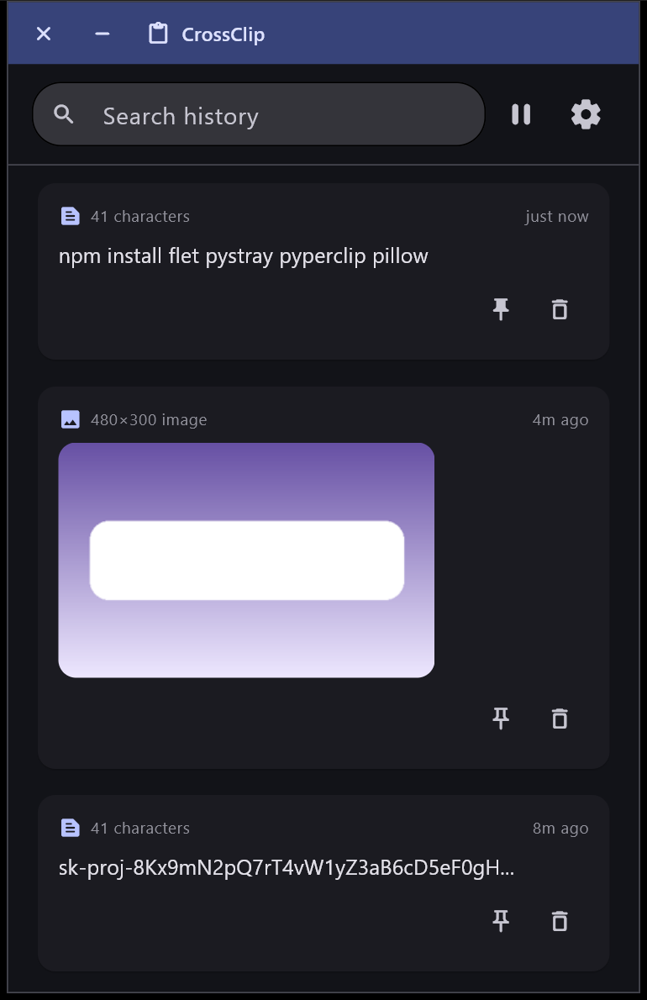
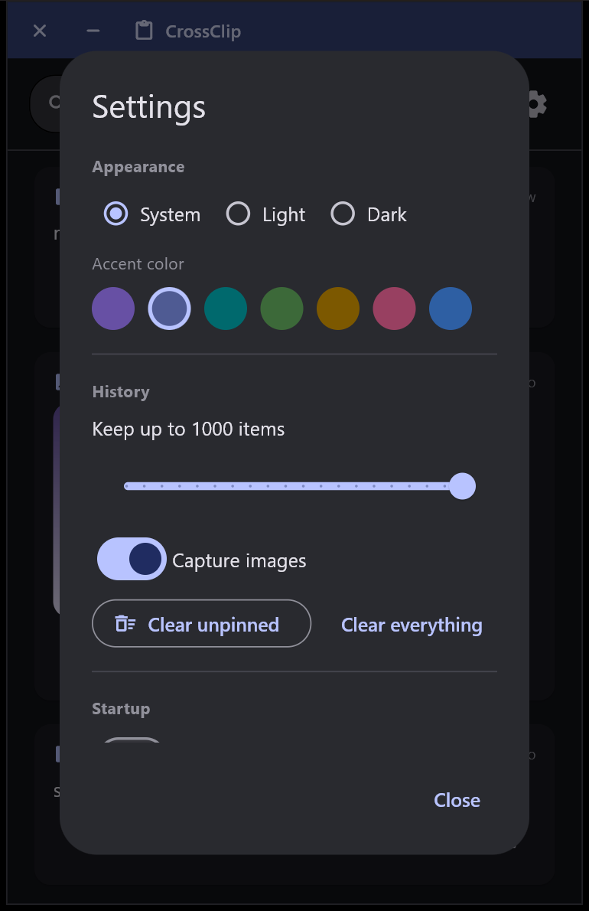

# CrossClip

A modern, Material You clipboard manager and history tracker for the desktop, built
with [Flet](https://flet.dev) (Flutter Material 3 widgets running on Python).

CrossClip runs quietly in the background and records everything you copy — text
and images — to a local SQLite database. Open the window any time to search,
re-copy, pin, or delete past clipboard entries, or leave it tucked away in the
system tray while it keeps watching the clipboard for you.

Runs on **Windows, macOS, and Linux**.

## Screenshots

| History | Settings |
|---|---|
|  |  |

## Features

- **Automatic capture** — every text or image copy is recorded while CrossClip runs.
- **Persistent history** — stored in a local SQLite database, so history survives restarts.
- **Text and images** — image copies are thumbnailed and stored alongside the full-size copy.
- **Search** — filter history by text content.
- **Pin** — keep important items at the top, exempt from auto-cleanup.
- **One-click copy back** — click any item to put it back on the clipboard.
- **History limit** — configurable cap on stored items; oldest unpinned items are pruned automatically.
- **Pause monitoring** — temporarily stop recording (e.g. before copying a password).
- **System tray** — closing the window hides it to the tray instead of quitting; monitoring keeps running in the background.
- **Launch on boot** — per-OS startup entry, can start minimized to the tray.
- **Material You theming** — dynamic color scheme generated from a chosen accent color, with light/dark/system modes.
- **Polished window** — custom frameless title bar, opens centered on screen with a fade-in/fade-out animation.

## Requirements

- Python 3.10+ (tested on 3.14)
- Windows, macOS, or Linux

### Platform notes

| Feature | Windows | macOS | Linux |
|---|---|---|---|
| Text capture/copy-back | native win32 clipboard | `pyperclip` | `pyperclip` (needs `xclip`/`xsel` or `wl-clipboard` installed) |
| Image capture | native win32 (DIB) | Pillow `ImageGrab` | Pillow `ImageGrab` (needs `xclip` or `wl-clipboard`) |
| Image copy-back | native win32 (DIB) | AppleScript (`osascript`, ships with macOS) | `xclip`/`wl-copy` (needs `xclip` or `wl-clipboard` installed) |
| Launch on boot | `HKCU...\Run` registry key | `~/Library/LaunchAgents` LaunchAgent | `~/.config/autostart` XDG `.desktop` entry |
| System tray | works out of the box | works out of the box | needs a tray host in your desktop environment (most have one; some minimal window managers don't) |
| Custom window icon | `.ico`, set at runtime | not set at runtime (needs an app bundle) | not set at runtime (needs a `.desktop` icon) |

On Linux, install a clipboard tool via your package manager, e.g.:

```bash
sudo apt install xclip        # X11
sudo apt install wl-clipboard # Wayland
```

## Setup

```bash
python -m venv .venv
```

```bash
# Windows
.venv\Scripts\activate
```

```bash
# macOS / Linux
source .venv/bin/activate
```

```bash
pip install -r requirements.txt
```

## Run

```bash
python main.py                  # opens the window
python main.py --minimized      # starts hidden in the system tray
```

The app keeps running in the tray after the window is closed (the close button
hides it rather than exiting) — use **Quit CrossClip** from the tray menu to
actually stop it.

## Launch on boot

Open **Settings** (gear icon) inside the app and toggle **Start with Windows**
(label follows the OS). This writes a per-user startup entry that launches
CrossClip hidden in the tray (`--minimized`):

- **Windows**: a value under `HKEY_CURRENT_USER\Software\Microsoft\Windows\CurrentVersion\Run`, using `pythonw.exe` so no console window appears.
- **macOS**: a LaunchAgent plist at `~/Library/LaunchAgents/com.crossclip.app.plist` (takes effect on next login).
- **Linux**: an XDG autostart entry at `~/.config/autostart/crossclip.desktop`, picked up by GNOME, KDE, XFCE, and most other desktop environments.

You can also enable **Start minimized to tray** so manual launches from a shortcut start hidden too.

## Data storage

- Windows: `%LOCALAPPDATA%\CrossClip`
- macOS: `~/Library/Application Support/CrossClip`
- Linux: `$XDG_DATA_HOME/CrossClip` (defaults to `~/.local/share/CrossClip`)

Contents:

- `history.db` — SQLite database of clipboard entries
- `images/` — full-size PNGs and thumbnails for image clips
- `settings.json` — app preferences
- `icon.ico` — generated window/tray icon (Windows only)

Deleting this folder resets CrossClip to a clean state.

## Project layout

```
main.py                    entry point (CLI args, wires everything together)
crossclip/
  config.py                paths + persisted Settings
  database.py               SQLite schema and CRUD
  clipboard_backend.py       per-OS clipboard access (Windows win32, macOS, Linux, generic fallback)
  monitor.py                  background thread that polls the clipboard and writes to the DB
  autostart.py                 per-OS "launch on boot" toggle (registry / LaunchAgent / XDG autostart)
  tray.py                       system tray icon (pystray)
  winfocus.py                    Windows-only: force the window to the real OS foreground on launch
  utils.py                       hashing/formatting/cross-thread change signal
  ui/
    app.py                        the Flet UI (Material You)
    theme.py                       Material You theme construction
```
